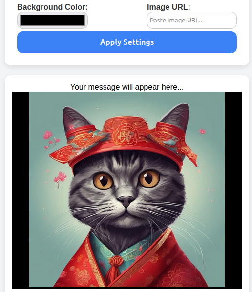

# ImageBackgroundCustomizer

ImageBackgroundCustomizer is a simple and intuitive tool that allows users to customize the background of an image. It provides options to change the text size, text color, background color, and even apply an image URL as the background.

## 🎨 Features

✅ **Customizable Text**: Adjust the size and color of the text.  
✅ **Background Customization**: Change the background color or set an image as the background.  
✅ **Live Preview**: See the changes instantly in the preview section.  
✅ **User-Friendly Interface**: Simple and easy-to-use design.

## 🚀 Installation

To use this project, simply clone the repository and open `index.html` in your browser.

```bash
git clone https://github.com/yourusername/ImageBackgroundCustomizer.git
cd ImageBackgroundCustomizer
open index.html


## 🖼️ Screenshot




